# 多因子选股策略 — 完整算法逻辑流图 v2.0

> 基于 `docs/strategy-plan-v2.md` v2.0 和 `docs/tech-plan.md` v2.0 交叉验证生成
> 所有算法节点均标注源文档出处，禁止虚构
> 最后同步: 2026-06-04 (strategy-plan-v2.md v2.0 系统性优化修订)

---

## 一、系统总体架构（数据流）

> 来源: tech-plan.md v2.0 §2.1 整体数据流, §2.2 模块依赖关系

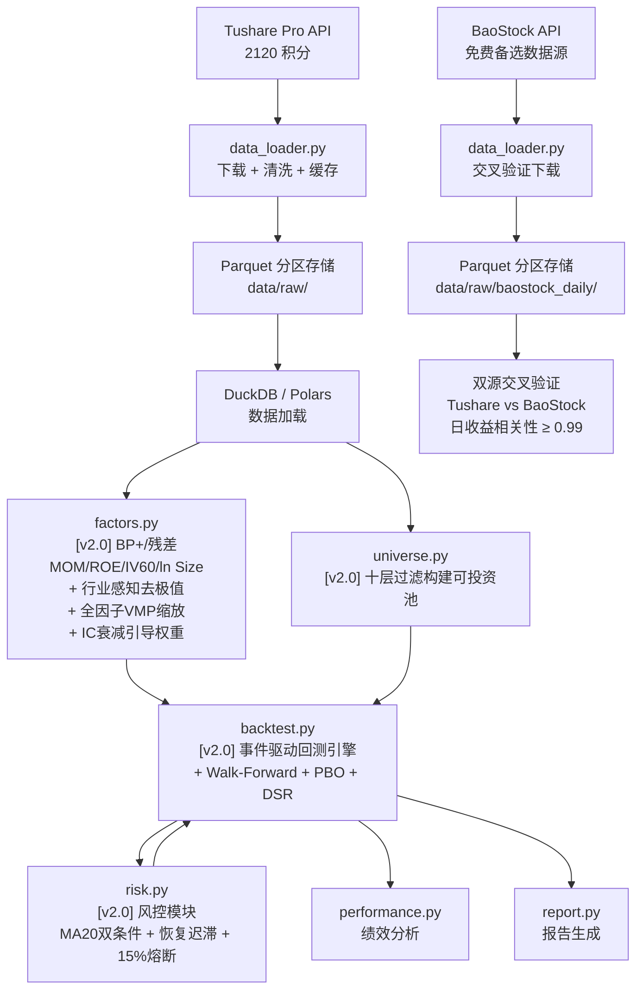

**关键依赖顺序**（tech-plan.md v2.0 §2.2）：
```
config.py → data_loader.py → {universe.py, factors.py} → backtest.py → {risk.py, performance.py, report.py}
```

---

## 二、数据下载全流程（Phase 1 核心）

> 来源: tech-plan.md v2.0 §3.1 数据下载流程, §3.2 各步骤详细设计

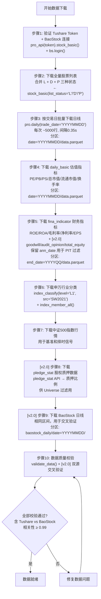

**步骤3 关键验证**（tech-plan.md v2.0 §1.2）：
- `pro_bar` 一次只能查询一只股票，不可批量
- 推荐使用 `pro.daily(trade_date='YYYYMMDD')` 按交易日批量下载
- 10年约2450个交易日 → ~2450次调用 → ~14分钟
- 速率控制: `time.sleep(0.35)` (200次/分钟, 留余量)

**[v2.0] BaoStock 交叉验证**（tech-plan.md v2.0 §1.3）：
- `pip install baostock`，零门槛，无需 token
- 使用涨跌幅复权法（与 Tushare 现金红利复权存在系统性差异）
- 仅用于交叉验证（比较日收益相关系数），不用于主策略计算
- Tushare 断服时可作为应急替代

**数据质量校验清单**（tech-plan.md v2.0 §3.4）：
- 股票列表按 ts_code 去重，无重复
- 每只股票有明确的 list_date 和 delist_date
- 日线每个 (ts_code, trade_date) 唯一
- 无未来日期数据
- 无负数价格或成交量为0的异常记录
- 退市股退市日期后无新数据
- 复权因子连续递增
- fina_indicator 的 ann_date ≥ end_date
- [v2.0] fina_indicator 含 goodwill, total_equity, audit_opinion 字段
- [v2.0] pledge_stat 数据覆盖全市场（> 4000 只股票）
- [v2.0] Tushare vs BaoStock 日收益 Pearson 相关系数 ≥ 0.99

---

## 三、可投资池构建（[v2.0] 十层过滤）

> 来源: strategy-plan-v2.md §4.1 第一步：构建可投资池

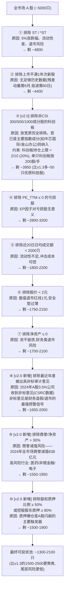

**行业标准对照**（strategy-plan-v2.md §4.1）：v2.0 的十层过滤在保留 v1.3 原有的流动性+基本面过滤基础上，增加了尾部风险过滤（审计意见→财务造假预警、商誉→减值风险预警、质押→爆仓风险预警），使 Universe 更聚焦于"优质且安全"的股票。

---

## 四、因子计算全流程 [v2.0 重写]

> 来源: strategy-plan-v2.md §二 因子体系, §三 信号合成流程; tech-plan.md v2.0 §4.4

### 4.1 原始因子计算 [v2.0]

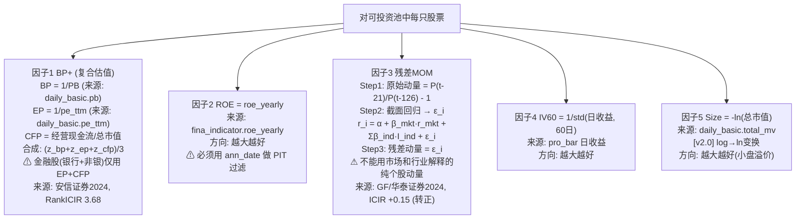

### 4.2 截面标准化 + 全因子VMP缩放 + IC引导权重合成 [v2.0 重写]

> 来源: strategy-plan-v2.md §三 信号合成流程

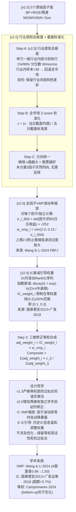

**v2.0 vs v1.3 因子流程核心差异**：

| 步骤 | v1.3 | v2.0 |
|------|------|------|
| 去极值 | 全市场 Winsorize | **行业感知** Winsorize（申万一级行业内） |
| 价值因子 | EP 单一 | **BP+ 复合** (BP+EP+CFP等权) |
| 动量因子 | 原始 6-1M 价格动量 | **残差动量**（市场+行业中性化） |
| Size | -log(总市值) | **-ln(总市值)** |
| VMP 缩放 | 仅动量, 上限=1.0 | **全5因子**, 上限=2.0 |
| 合成权重 | 等权 | **IC衰减引导** (±50%安全阀) + VMP |

### 4.3 PIT (Point-in-Time) 财务数据过滤

> 来源: strategy-plan-v2.md §4.2 关键：财务数据必须用公告日

| 报告期 | 截止日 (end_date) | 法定最晚公告日 | 使用时点 |
|--------|-------------------|---------------|---------|
| 年报 | 12-31 | 次年 4-30 | ann_date ≤ 当前交易日 |
| 一季报 | 03-31 | 当年 4-30 | ann_date ≤ 当前交易日 |
| 半年报 | 06-30 | 当年 8-31 | ann_date ≤ 当前交易日 |
| 三季报 | 09-30 | 当年 10-31 | ann_date ≤ 当前交易日 |

**示例**：2024-05-15 调仓，能用的最新 ROE 是 2024 年一季报（4月30日前公告的），不能用 2024 半年报（8月才公告）。不做此过滤，回测将"穿越"使用未来数据，结果显著高估。

---

## 五、月度调仓核心算法

> 来源: strategy-plan-v2.md §4.4-§4.6

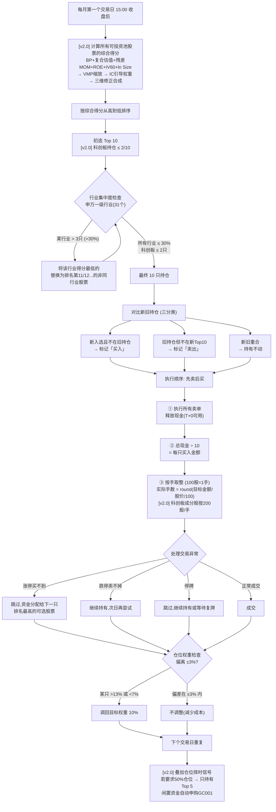

### 按市值处理交易单位

> 来源: strategy-plan-v2.md §4.6

| 股价 | 1手金额 | 买入手数 | 实际投入 | 权重偏差 |
|------|---------|---------|---------|---------|
| 5元 | 500元 | 20手 | 10,000元 | 0% |
| 15元 | 1,500元 | 7手 | 10,500元 | +0.5% |
| 42元 | 4,200元 | 2手 | 8,400元 | -1.6% |
| 88元 | 8,800元 | 1手 | 8,800元 | -1.2% |

极端情况: 股价 > 200元 (一手 > 2万) → 直接跳过选下一只。

---

## 六、回测引擎主循环（事件驱动）[v2.0 Walk-Forward]

> 来源: tech-plan.md v2.0 §4.6 backtest.py, §5.1-§5.4; strategy-plan-v2.md §六 Phase 3

### 6.1 单次回测主循环

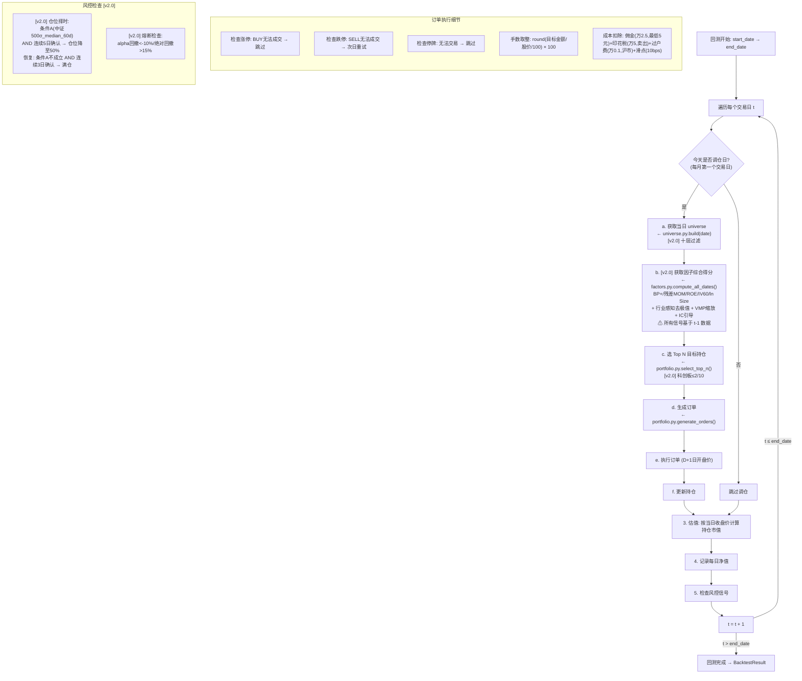

### 6.2 [v2.0] Walk-Forward 滚动回测框架

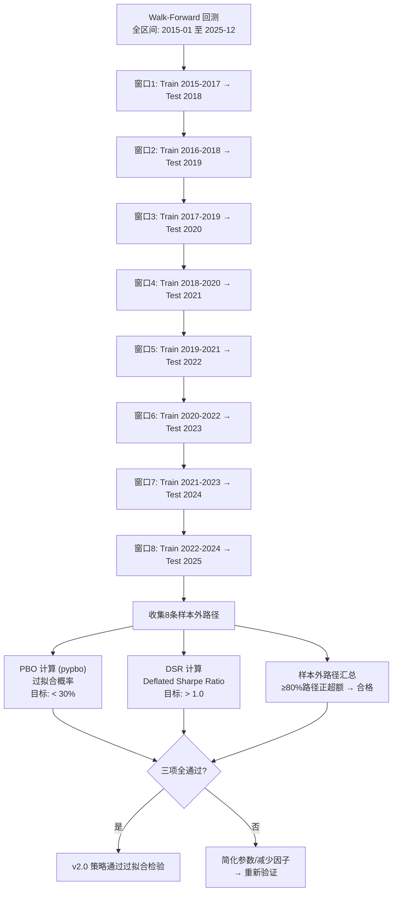

### T+1 制度执行时序

> 来源: tech-plan.md v2.0 §5.2

```
D日 15:00  收盘 → [v2.0] 计算BP+/残差MOM/ROE/IV60/ln Size → VMP缩放 + IC引导 → 综合得分 → 选出新持仓 → 生成订单
D+1日 09:30 开盘 → 执行订单(以开盘价成交)
     ├─ 先执行所有卖单 → 释放现金
     │   资金 T+0 可用 (当日可买入), T+1 可取
     └─ 再执行买单 → 用总现金 ÷ 10 计算每只金额
D+1日 15:00 收盘 → 新持仓生效
```

---

## 七、风险管理三层架构 [v2.0]

> 来源: strategy-plan-v2.md §五 风险管理体系

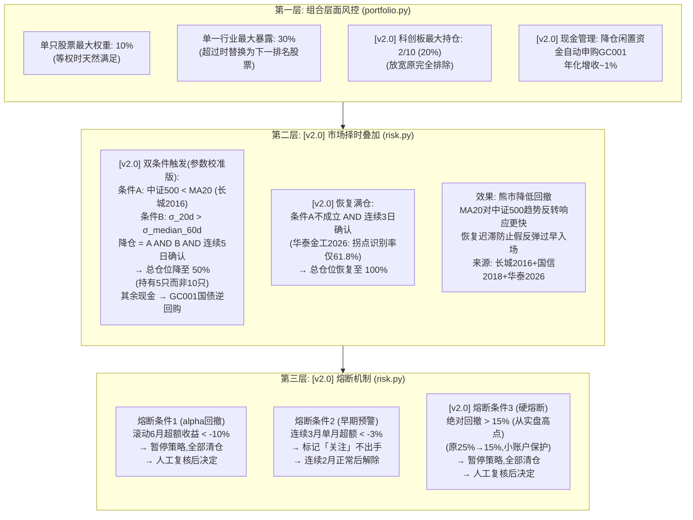

**设计原则**（strategy-plan-v2.md §5.1）：区分 beta 回撤（市场系统性下跌）和 alpha 回撤（策略选股失效）。市场跌但超额为正 → 策略正常，不应熔断。极端系统性风险 → 硬熔断保护本金。[v2.0] 15% 硬熔断对小账户（10万）更合理——亏15%仅1.5万，亏25%需赚33%才能回本。

---

## 八、因子健康度持续监控 [v2.0]

> 来源: strategy-plan-v2.md §六 Phase 5

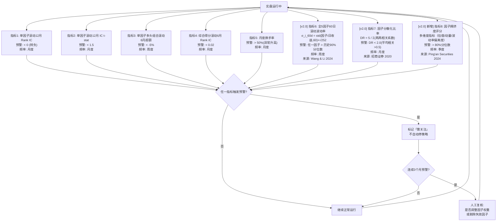

---

## 九、防过拟合体系 [v2.0 扩展]

> 来源: strategy-plan-v2.md §七 防过拟合措施

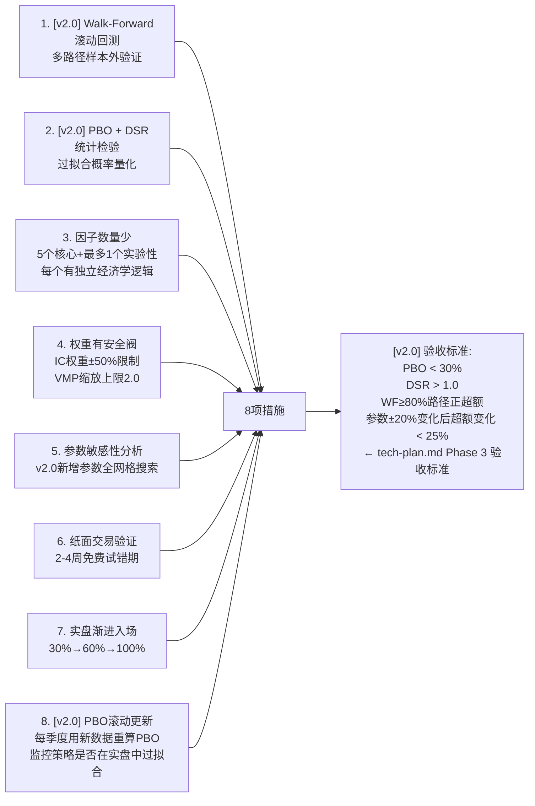

---

## 交叉验证清单

| 流程图 | 来源文档 | 关键章节 |
|--------|---------|---------|
| 一、系统总体架构 | tech-plan.md v2.0 | §2.1, §2.2 |
| 二、数据下载全流程 | tech-plan.md v2.0 | §1.2, §1.3, §3.1-§3.4 |
| 三、可投资池构建（十层过滤） | strategy-plan-v2.md v2.0 | §4.1 |
| 四、因子计算全流程（BP+/残差MOM/VMP全扩展/IC引导） | strategy-plan-v2.md v2.0 §二, §三 + tech-plan.md v2.0 §4.4 | — |
| 五、月度调仓核心算法 | strategy-plan-v2.md v2.0 | §4.4-§4.6 |
| 六、回测引擎（MA20 + Walk-Forward） | tech-plan.md v2.0 §4.6, §5.1-§5.4 + strategy-plan-v2.md §六 Phase 3 | — |
| 七、风险管理三层架构（MA20 + 恢复迟滞 + 15%熔断） | strategy-plan-v2.md v2.0 | §5.1-§5.2 |
| 八、因子健康度监控（+拥挤度指标） | strategy-plan-v2.md v2.0 | §六 Phase 5 |
| 九、防过拟合体系（WF + PBO + DSR） | strategy-plan-v2.md v2.0 §七 + tech-plan.md v2.0 §七 | — |

---

## v2.0 参数速查表

| 参数 | v1.3 值 | v2.0 值 | 所属模块 | 来源 |
|------|--------|--------|---------|------|
| `sigma_target` | 0.15（仅动量） | 0.15（全部因子） | `config.py` → `factors.py` | Wang & Li (2024) |
| `mom_lookback` | 60 | 60 | `config.py` → `factors.py` | Moreira & Muir (2017) |
| `vmp_upper_bound` | 1.0 | **2.0** | `config.py` → `factors.py` | v2.0 新增 |
| `ic_lookback_months` | — | **24** | `config.py` → `factors.py` | 国泰君安 (2013) |
| `ic_half_life_months` | — | **6** | `config.py` → `factors.py` | 中信建投 (2019) |
| `ic_weight_deviation_max` | — | **0.5** | `config.py` → `factors.py` | v2.0 安全阀 |
| `ma_period` | 60 | **20** | `config.py` → `risk.py` | 长城证券 (2016) |
| `vol_window` | 20 | 20 | `config.py` → `risk.py` | 国信证券 (2018) |
| `vol_percentile` | 0.50 | 0.50 | `config.py` → `risk.py` | 长城证券 (2016) |
| `hysteresis_down` | 5 | 5 | `config.py` → `risk.py` | 行业惯例 |
| `hysteresis_up` | —（立即） | **3** | `config.py` → `risk.py` | 华泰金工 (2026) |
| `hard_drawdown_limit` | -0.25 | **-0.15** | `config.py` → `risk.py` | 小账户保护 |
| `max_star_market_weight` | 0（完全排除） | **2** | `config.py` → `portfolio.py` | v2.0 放宽 |
| `walk_forward_train_years` | —（单次分割） | **3** | `config.py` → `backtest.py` | Lopez de Prado (2018) |
| `walk_forward_test_years` | — | **1** | `config.py` → `backtest.py` | Lopez de Prado (2018) |
| `pbo_threshold` | — | **0.30** | `config.py` → `validation.py` | Joubert et al. (2024) |
| `enable_gc001` | — | **true** | `config.py` → `portfolio.py` | v2.0 新增 |
