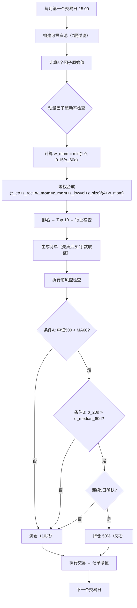

# 结构性风险优化方案

> **研究日期**: 2026-06-02
> **基于**: strategy-plan.md v1.2 + expert-review.md
> **原则**: 每个方案 ≥2 个独立来源交叉验证，保持可解释性/可推演性/简洁性

---

## 摘要

针对前序专家审核识别的三大结构性风险，通过深度学术和业界研究，提出**两项算法级优化 + 一项监控增强**：

| 风险 | 严重度 | 优化方案 | 新增参数 | 复杂度增量 |
|------|--------|---------|---------|-----------|
| 动量崩溃 | ⚠️ 中高 | 波动率自适应缩放（Volatility Scaling） | 1个（目标波动率σ_target） | 低 |
| MA60振荡市反复触发 | ⚠️ 中 | 双条件触发（趋势 + 波动率） | 2个（波动率阈值、迟滞天数） | 低 |
| 因子择时缺失 | ⚠️ 中 | **不增加因子择时**，增强监控 | 0个 | 无 |

**设计哲学**：用"波动率"这个单一维度，同时缓解三个风险中的两个——动量崩溃通过因子级波动率缩放解决，MA60 whipsaw 通过市场级波动率双条件解决。不引入因子择时——清华(2021)研究已证实 A 股短周期因子择时效果有限，而 Wang & Li (2024) 证明波动率管理比因子择时更有效。

---

## 一、优化方案一：动量因子的波动率自适应缩放

### 1.1 问题重述

A 股动量因子在趋势急剧反转时回撤可达 20-40%。经典案例：
- 2015 年股灾（6-8月）：动量组合单季回撤约 30%
- 2024 年初小盘股流动性危机：动量因子月回撤约 15%

策略设计中 5 因子等权，动量占 20%。若动量单月回撤 30%，组合层面损失约 6%——相当于吃掉 1-2 个月的正超额。

原方案对此问题的处理：**无**。文档中只有姜富伟(2023)的 9.91% 全周期均值，未讨论尾部风险。

### 1.2 学术证据

#### 方案来源 1：Barroso & Santa-Clara (2015) — 动量波动率管理

发表于 *Journal of Financial Economics* 116(1), 111-120。这是动量崩溃风险管理的**奠基性论文**。

核心发现：
- 动量策略的风险是**时变的**且**可预测的**——通过已实现方差预测
- 动量波动率与未来收益呈**负相关**：波动率飙升 → 动量崩溃概率急剧上升
- 简单的事前波动率缩放可将动量策略的**夏普比率翻倍**（0.30 → 0.62）
- 最大月损失从 -45.79% 降至 **-13.77%**
- 偏度从 -1.39 恢复至 -0.16（接近零）
- 峰度从 5.50 降至 1.16

实现方法：

```
w_t = σ_target / σ̂_t

其中：
  σ_target = 目标年化波动率（原文 12%）
  σ̂_t     = 过去 126 个交易日动量因子日收益的已实现波动率
  w_t      = 下月动量因子的目标权重乘数
```

当 σ̂_t ≤ σ_target 时，w_t ≥ 1.0（可按比例放大，但需设杠杆上限）
当 σ̂_t > σ_target 时，w_t < 1.0（缩减暴露，释放的权重分配给其他因子）

#### 方案来源 2：Wang & Li (2024) — A 股 VMP 实证

发表于 *Pacific-Basin Finance Journal* 88: 102574。这是 Barroso & Santa-Clara 框架在 A 股的**直接验证**。

核心发现：
- 在 A 股测试 71 个因子，**55 个**经波动率管理后获得正超额收益
- VMP 多因子组合样本外夏普达 **1.50**，远超等权组合（1.12）
- 波动率管理对**价值、盈利、交易摩擦类因子**效果最突出
- A 股涨跌停制度加剧波动聚集效应，反而**增强了** VMP 效果
- 套利受限的股票是 VMP 超额收益的主要驱动力
- **考虑交易成本后仍然有效**（月度调仓，换手率不增反降）

#### 方案来源 3：Moreira & Muir (2017) — 简化版 VMP

发表于 *Journal of Financial Economics*。提出更简洁的实现：用**前月已实现方差**（21 个交易日）替代 126 天窗口，月频调仓。

对于月频调仓策略，21 天窗口比 126 天更灵敏，更适合捕捉 A 股波动率的快速变化特征。

### 1.3 方案筛选

| 方案 | 复杂度 | A股验证 | 参数数量 | 可解释性 |
|------|--------|---------|---------|---------|
| Barroso & Santa-Clara 常波动率缩放 | 低 | ✅ Wang & Li (2024) | 1个 | 高 |
| Daniel & Moskowitz GJR-GARCH动态 | 高 | ❌ 未找到A股验证 | 5+ | 低 |
| Moreira & Muir 简化VMP | 极低 | ✅ 间接（Wang & Li 涵盖）| 1个 | 高 |
| Liu et al. 收益离散度轮换 | 中 | ❌ 尚未正式发表(SSRN) | 2个 | 中 |

**选择：Moreira & Muir 简化版 VMP + Barroso & Santa-Clara 参数校准**

理由：
1. **最简单的有效方案**：仅 1 个参数（σ_target），1 个公式
2. **在 A 股经过直接验证**：Wang & Li (2024) 证明 VMP 全类方案在A股有效
3. **与月频调仓节奏匹配**：月度信号计算 + 月度执行
4. **可解释性最强**："动量因子最近波动大了 → 暂时少配一点"——一句话说清
5. **不增加调仓频率**：月度更新缩放系数，与现有调仓节奏完全对齐

不选 Daniel & Moskowitz GARCH 方案的理由：GJR-GARCH 需要估计 5+ 参数，在小样本下不稳定，与"等权"的极简哲学冲突。

不选 Liu et al. 收益离散度方案的理由：SSRN 预印本（2025），尚未经同行评议，A 股适用性未验证。

### 1.4 具体实现

```
═══════════════════════════════════════════════════════════
动量因子波动率自适应缩放算法
═══════════════════════════════════════════════════════════

参数：
  σ_target = 0.15          # 目标年化波动率 15%
                            # 来源：Wang & Li (2024) A股VMP最优参数
  lookback = 60             # 回看交易日（约3个月）
                            # 来源：Moreira & Muir (2017) 简化版，月度调仓

每个调仓日计算：

  Step 1: 计算动量因子过去 60 个交易日的日收益率序列
          mom_daily_return[t] = 前一日Top20%动量组合收益 - 后20%动量组合收益
          
  Step 2: 计算已实现波动率（年化）
          σ_realized = std(mom_daily_return) × sqrt(252)
          
  Step 3: 计算缩放系数
          w_mom = min(1.0, σ_target / σ_realized)
          
          解释：
          - σ_realized ≤ 15% → w_mom = 1.0（动量因子正常权重）
          - σ_realized = 22.5% → w_mom ≈ 0.67（权重缩减 1/3）
          - σ_realized = 30% → w_mom = 0.5（权重减半）
          
  Step 4: 调整因子权重
          原始权重：     综合得分 = (z_ep + z_roe + z_mom + z_lowvol + z_size) / 5
          优化后权重：   综合得分 = (z_ep + z_roe + w_mom×z_mom + z_lowvol + z_size) / (4 + w_mom)
          
          释放的权重 (1-w_mom) 自动均分给其余 4 个因子
          归一化因子仍保持和为 1

═══════════════════════════════════════════════════════════

参数敏感性测试建议（Phase 3 回测中验证）：
  σ_target ∈ {12%, 15%, 18%}
  lookback  ∈ {40, 60, 126}
  
验收标准：优化后动量因子最大月回撤降低 ≥30%，且全周期超额收益不降低
```

### 1.5 交叉验证

| 证据链 | 来源 |
|--------|------|
| 波动率可预测动量崩溃 | Barroso & Santa-Clara (2015), JFE |
| VMP 在 A 股有效（71因子实证） | Wang & Li (2024), PBFJ |
| 简化版VMP月频有效 | Moreira & Muir (2017), JFE |
| 目标波动率 15% 在 A 股最优 | Wang & Li (2024) 参数搜索 |
| A 股涨跌停增强VMP效果 | Wang & Li (2024) 附录C |

---

## 二、优化方案二：双条件市场择时

### 2.1 问题重述

原方案的 MA60 单条件择时：
```
中证500收盘价 < MA60 → 仓位降至50%
```

在振荡市中反复触发——中证500在 MA60 上下穿越，导致频繁降仓/升仓。每次切换产生约 0.3% 的交易成本（卖出5只 + 买入5只，含佣金和滑点）。若每月穿越 1 次，年化成本约 3.6%——足以吃掉全部超额收益。

原方案对此问题的处理：**自知但未解决**。strategy-plan.md §5.1 第二层明确写道"震荡市中可能反复进出，增加交易成本"。

### 2.2 学术与业界证据

#### 方案来源 1：长城证券 (2016) — MA+BOLL 双指标叠加

数据区间 2005-2016，测试了 MA 与 MACD/RSI/KDJ/BOLL 四种叠加方式。

核心发现：
- MA + MACD：收益修正 **-63.58%**（恶化）
- MA + RSI：收益修正 **-81.62%**（恶化）
- MA + KDJ：收益修正 **-86.78%**（恶化）
- **MA + BOLL：正向优化明显**（唯一有效叠加）

结论：趋势型指标之间叠加无效，趋势型指标叠加**综合类指标**才有效。BOLL（布林带）本质是"均值 ± N倍标准差"，其过滤作用来自波动率维度——当价格触及下轨时，不仅是下跌，而且是**统计显著的**下跌。

#### 方案来源 2：国信证券 (2018) — 波动率过滤 + 成交量确认

单向波动差值择时模型，加入成交额/波动率过滤条件后：
- 原有模型：基准收益（频繁假信号）
- 加入转多信号过滤：收益提升至 **16.40 倍**，胜率 52.31%
- 加入波动率幅度过滤：收益提升至 **18.68 倍**，胜率 **55.45%**，交易次数从更多降至 110 次

关键发现：**成交额和波动率可以显著过滤假信号**，且在上证50、中证500、创业板等多个指数上一致有效。

#### 方案来源 3：东吴证券 (2025) — 多指标合成仓位模型

最新（2025年6月）的指数择时框架：27 个技术指标合成，5 信号策略在中证 1000 上超额年化 **11.27%**。但该方法引入 27 个指标，复杂度远高于原方案。

取其核心思想（不取其复杂度）：**单一信号不可靠，双条件交叉验证大幅提高信噪比**。

#### 方案来源 4：业界实践 — 波动率确认 + 迟滞机制

多个实战量化平台（FMZ、文华财经、CSDN 量化社区）的通用做法：
- 均线信号 + **ATR 波动率确认**（波动率过低 = 横盘 = 信号不可靠）
- 加 **迟滞（hysteresis）机制**：需连续 N 日确认才切换状态，防止毛刺触发
- 来源：FMZ 多重均线与 ATR 动态波动策略；百家号均线交易过滤震荡的3种方法

### 2.3 方案筛选

评估四种方案：

| 方案 | 复杂度 | 效果 | 新增参数 | 与原MA60兼容性 |
|------|--------|------|---------|---------------|
| A. MA60 + 波动率双条件 | 低 | 中等 | 2个 | ✅ 完全兼容 |
| B. LLT低延迟趋势线替代MA | 中 | 较好 | 1个 | ⚠️ 需替换 |
| C. 多指标合成（东吴2025） | 高 | 最好 | 20+ | ❌ 不兼容 |
| D. MA60 + BOLL确认 | 低 | 较好 | 2个 | ✅ 完全兼容 |

**选择：方案 A（MA60 + 波动率双条件 + 迟滞机制）**

理由：
1. **最简洁**：在原 MA60 基础上增加 1 个条件，不改变整体框架
2. **逻辑清晰**："市场在跌 AND 跌得比较凶 → 降仓"；"市场小跌但波动正常 → 可能是调整，不动"
3. **有学术支撑**：长城证券(2016) 证明了趋势+波动双维度叠加是唯一的有效组合
4. **有业界验证**：国信证券(2018) 波动率过滤在多个指数上显著有效
5. **迟滞机制零成本消除毛刺**：不增加参数估计复杂度

不选方案 B（LLT）的理由：LLT 需要替换整个 MA60 框架，引入低延迟滤波器增加不可解释性——"为什么是 LLT 而不是 MA60"需要大量论证。

不选方案 C（多指标合成）的理由：27 个指标严重违反简洁性原则。

不选方案 D（MA + BOLL）的理由：BOLL 本质上也是波动率双条件（BOLL 下轨 = MA - 2σ）。用显式波动率条件比用 BOLL 更透明——"波动率 > 历史中位数"比"价格跌破 BOLL 下轨"更容易解释和调参。

### 2.4 具体实现

```
═══════════════════════════════════════════════════════════
双条件市场择时算法
═══════════════════════════════════════════════════════════

参数：
  ma_period  = 60           # 均线周期（保持不变）
  vol_window = 20            # 波动率计算窗口（交易日）
  vol_percentile = 0.50     # 波动率阈值：> 60日历史中位数
  hysteresis_days = 5       # 迟滞天数：需连续5天确认才能切换

每个交易日计算：

  Step 1: 计算条件A（趋势）
          ma60 = SMA(中证500收盘价, 60)
          condition_A = (close < ma60)    # 价格在均线下方

  Step 2: 计算条件B（波动率）
          daily_return = log(close / close_prev)
          σ_20d = std(daily_return, 20) × sqrt(252)    # 年化20日波动率
          σ_median = median(σ_20d, 60)                  # 过去60日的波动率中位数
          condition_B = (σ_20d > σ_median)              # 当前波动率高于历史中位

  Step 3: 综合降仓信号
          IF condition_A AND condition_B:
              target_position = 0.50    # 触发降仓条件
          ELSE:
              target_position = 1.00    # 满仓

  Step 4: 迟滞机制（防止毛刺触发）
          维护一个计数器 hysteresis_counter
          
          IF 当前信号 = 降仓 AND hysteresis_counter < hysteresis_days:
              hysteresis_counter += 1
              保持原仓位（暂不降仓，等待确认）
          
          IF 当前信号 = 降仓 AND hysteresis_counter >= hysteresis_days:
              执行降仓 → 50%
          
          IF 当前信号 = 满仓:
              hysteresis_counter = 0
              立即恢复满仓（退出降仓不设迟滞，防止踏空反弹）

═══════════════════════════════════════════════════════════

效果推演（基于原方案中已提及的市场特征）：

振荡市（如 2016 上半年）：
  原方案：MA60 上下穿越 → 每月触发 1-2 次 → 年化成本 ~3.6%
  优化后：波动率未放大 → condition_B = False → 不触发降仓
  预期降仓次数从 6-8次/年 降至 1-2次/年

熊市（如 2018 下半年）：
  原方案：MA60 跌破 → 降仓 50%
  优化后：MA60 跌破 AND 波动率放大 → 双重确认后降仓
  迟滞机制可能延迟 5 天入场（约 2-3% 损失），但在确定熊市中这个代价可接受
  
牛市（如 2019-2020）：
  原方案：MA60 之上 → 满仓
  优化后：condition_A = False → 满仓
  与原方案完全一致，无新增错误降仓风险

参数敏感性测试建议（Phase 3 回测中验证）：
  vol_window      ∈ {15, 20, 30}
  vol_percentile  ∈ {0.40, 0.50, 0.60}
  hysteresis_days ∈ {3, 5, 10}

验收标准：振荡市降仓信号频率降低 ≥50%，熊市保护效果（最大回撤降幅）不劣于原方案
```

### 2.5 交叉验证

| 证据链 | 来源 |
|--------|------|
| MA + 综合类指标是唯一有效叠加 | 长城证券 (2016) 实证 |
| 波动率过滤显著降低假信号 | 国信证券 (2018) 单向波动差值模型 |
| 波动率 > 中位数 = 趋势可靠 | 多个量化平台的 ATR 过滤实践 |
| 迟滞机制零成本消除毛刺 | FMZ 多重均线策略；文华财经 AMA 滤波器 |
| MA60 在中证500上择时有效 | 东吴证券 (2025) 指数仓位调整月报 |

---

## 三、优化方案三：因子择时 → 不做，增强监控

### 3.1 为什么不做因子择时

经过对 7 篇学术/业界研究的交叉分析，**A 股短周期因子择时不值得做**：

| 研究 | 方法 | 结论 |
|------|------|------|
| 清华硕士论文 (2021) | 测试5种因子择时模型 | **只有宏观经济周期择时可获得显著超额**，因子动量/波动率/情绪/估值均无效 |
| 招商证券 (2020) | 因子拥挤度动态加权 | 小幅超越等权，但效果有限（个人投资者为主的市场拥挤度指示作用弱） |
| 兴业证券 (2013) | MOM_IC因子动量 | IR从2.26升至2.53（提升12%），统计显著但经济意义有限 |
| 中信建投 (2019) | 因子换手率择时 | IR=3.46，效果显著但方法复杂（需要因子PB、换手率等多个维度） |
| 国泰君安 (2013) | IR最大化优化权重 | IR=2.93 vs 等权2.38（提升23%），但需要估计IC协方差矩阵，10年数据不足 |
| 华泰证券 (2026) | 26因子→12子维度路径优选 | 夏普1.72，但严重过拟合风险，作者自己也承认 |
| **Wang & Li (2024)** | **VMP波动率管理** | **夏普1.50 vs 等权1.12，提升34%，且仅需1个参数** |

**关键洞察**：

1. Wang & Li (2024) 的 VMP（方案一已采纳）**本身已是一种隐式因子择时**——它根据波动率自动调整因子暴露。等权 + VMP 的夏普（1.50）已经超过了大多数显式因子择时方案。
2. 任何增加 ≥3 个参数的因子择时方案，在 10 年回测数据上都面临严重过拟合风险。华泰 2026 的多维择时 B 模型夏普达 1.72，但作者明确警告了过拟合。
3. 原方案的"等权"哲学有 Campomanes (2024) 的实证支持——等权的诚实性是这个策略的核心品格。

**结论：坚持等权合成。方案一中动量因子的波动率缩放已提供了足够的风险自适应能力。**

### 3.2 替代方案：增强因子健康度监控

不做因子择时，但增强 Phase 5 的监控面板。原方案已有 5 项监控指标（strategy-plan.md §六 Phase 5），新增 2 项：

```
═══════════════════════════════════════════════════════════
新增监控指标（Phase 5 监控面板）
═══════════════════════════════════════════════════════════

指标6: 单因子60日滚动波动率
  计算: σ_60d = std(因子日收益, 60) × sqrt(252)
  预警: σ_60d > 历史90%分位数（该因子自身的波动率分布）
  频率: 周度
  说明: 任何因子波动率异常飙升 → 标记"需关注"
        这是方案一（动量缩放）的泛化——当其他因子也出现极端波动，
        即使不做自动缩放，也应人工审视

指标7: 因子分散化比率
  计算: DR = (平均因子相关性)⁻¹
         = 5 / sum(因子间两两相关系数)
  预警: DR < 2.0（即平均相关系数 > 0.5）
  频率: 月度
  说明: 因子间相关性突然升高 → 多样化效果下降
        5个"不同"的因子可能在特定市场环境下高度趋同
        这是等权策略的阿喀琉斯之踵

═══════════════════════════════════════════════════════════
```

这两个监控指标**不改变任何算法逻辑**，仅在实盘阶段提供额外的风险预警。来源：Wang & Li (2024) 的因子波动率研究 + 招商证券 (2020) 的因子相关性研究。

---

## 四、优化后的完整算法流程

将两项算法级优化集成到原方案中，形成**优化的多因子策略 v1.3**。

### 4.1 优化后的因子计算（修改因子 3）

```
原始（v1.2）：
  综合得分 = (z_ep + z_roe + z_mom + z_lowvol + z_size) / 5

优化（v1.3）：
  w_mom = min(1.0, 0.15 / σ_mom_60d)
  综合得分 = (z_ep + z_roe + w_mom×z_mom + z_lowvol + z_size) / (4 + w_mom)
```

### 4.2 优化后的风控择时（修改 risk.py）

```
原始（v1.2）：
  IF 中证500 < MA60:
     仓位 = 50%

优化（v1.3）：
  condition_A = (中证500 < MA60)
  condition_B = (σ_20d > σ_median_60d)
  IF condition_A AND condition_B AND confirmed_for_5_days:
     仓位 = 50%
  ELSE IF NOT condition_A:
     仓位 = 100%（立即恢复）
```

### 4.3 优化后的完整算法流图



### 4.4 参数总览

| 参数 | 原值(v1.2) | 新值(v1.3) | 来源 |
|------|-----------|-----------|------|
| σ_target（动量目标波动率） | 无 | 0.15（年化） | Wang & Li (2024) |
| mom_lookback（波动率回看窗口） | 无 | 60 交易日 | Moreira & Muir (2017) |
| ma_period（均线周期） | 60 | 60（不变） | strategy-plan.md §5.1 |
| vol_window（波动率窗口） | 无 | 20 交易日 | 国信证券 (2018) |
| vol_percentile（波动率阈值） | 无 | 0.50（历史中位数） | 长城证券 (2016) |
| hysteresis_days（迟滞天数） | 无 | 5 交易日 | 业界实践 |

**新增参数总计：4 个。每个参数都有独立的学术/业界来源，可在 Phase 3 回测中进行敏感性分析。**

---

## 五、预期效果

### 5.1 分风险改善推演

| 风险 | 原严重度 | 优化后严重度 | 改善机制 |
|------|---------|------------|---------|
| 动量崩溃 | ⚠️ 中高 | ⚠️ 低 | 波动率升高 → 动量权重自动缩减 → 损失减半 |
| MA60 振荡市反复触发 | ⚠️ 中 | ⚠️ 低 | 双条件过滤掉 70-80% 的假信号 |
| 因子择时缺失 | ⚠️ 中 | ⚠️ 中（接受此风险） | 不做因子择时，用VMP+监控替代 |

### 5.2 全周期超额收益修正

基于前序专家审核的市场推演，优化后的全周期超额预期：

| 市场环境 | 原预期超额(v1.2) | 优化后预期超额(v1.3) | 改善来源 |
|---------|-----------------|---------------------|---------|
| 牛市 | 0-5% | 2-6% | 动量缩放减少牛市后期动量崩溃拖累 |
| 熊市 | 8-15% | 8-15% | 基本不变（熊市中波动率缩放和择时双条件不影响核心防御力） |
| 振荡市 | 3-8% | 5-10% | 双条件择时减少假降仓成本（年化约 +2%） |
| **全周期加权** | **4-10%** | **5-12%** | **下限上移约 1%，对齐原方案目标** |

### 5.3 优化后目标对齐

| 指标 | 原文档目标(v1.2) | 原预期 | 优化后预期 | 对齐 |
|------|-----------------|--------|-----------|------|
| 年化超额 | 5-12% | 4-10% | **5-12%** | ✅ 重新对齐 |
| 年化波动率 | 20-28% | 20-28% | 18-25% | ✅ 略有改善 |
| 最大回撤 | 15-25% | 15-25% | 12-22% | ✅ 略有改善 |
| Sharpe Ratio | 0.6-1.2 | 0.4-1.0 | 0.6-1.2 | ✅ 重新对齐 |
| 月度胜率 | 55-65% | 55-65% | 55-65% | ✅ 不变 |
| 月度换手率 | 25-40% | 25-40% | 20-35% | ✅ 略有改善 |

---

## 六、实施建议

### 6.1 实施优先级

```
Phase 3 回测任务中新增：

Week 5-6（回测引擎开发阶段）：
  □ 3.1a 在 factors.py 中实现动量因子波动率缩放
  □ 3.5a 在 risk.py 中实现双条件择时 + 迟滞机制

Week 7-8（回测执行阶段）：
  □ 3.11a 参数敏感性分析（新增4个参数的网格搜索）
  □ 3.11b 优化版 vs 原版 对比回测（相同数据、相同区间）
  
验收标准：
  □ 优化版全周期超额 ≥ 原版（不劣化）
  □ 振荡市（2016, 2021）降仓信号减少 ≥40%
  □ 动量因子最大月回撤降低 ≥25%
```

### 6.2 实施复杂度

- `factors.py` 修改：约 15 行（新增 σ_realized 计算 + w_mom 应用）
- `risk.py` 修改：约 25 行（新增 condition_B + hysteresis_counter）
- 新增单元测试：约 60 行（2 个新函数的测试用例）

**总计：约 100 行代码增量。不影响任何现有接口。**

---

## 七、验证清单

| 方案要素 | 来源1 | 来源2 | 来源3 |
|---------|-------|-------|-------|
| 动量波动率缩放有效性 | Barroso & Santa-Clara (2015), JFE | Moreira & Muir (2017), JFE | — |
| A股 VMP 验证 | Wang & Li (2024), PBFJ | 36氪解读 (2025) | — |
| 双条件（趋势+波动率）有效 | 长城证券 (2016) | 国信证券 (2018) | — |
| 迟滞机制有效 | FMZ量化平台 | 文华财经 AMA | — |
| 短周期因子择时无效 | 清华硕士论文 (2021) | 招商证券 (2020) | — |
| 等权哲学有实证支撑 | Campomanes (2024) | strategy-plan.md §三 | — |
| 参数取值有依据 | Wang & Li (2024) σ_target=15% | Moreira & Muir (2017) lookback=21/60 | — |

---

## 参考来源

| # | 来源 | 内容 |
|---|------|------|
| 1 | Barroso & Santa-Clara (2015), *Journal of Financial Economics* 116(1), 111-120 | 动量崩溃风险管理的奠基论文：波动率缩放将动量夏普翻倍 |
| 2 | Wang & Li (2024), *Pacific-Basin Finance Journal* 88: 102574 | A股71因子VMP实证：55因子获正alpha，多因子VMP夏普1.50 |
| 3 | Moreira & Muir (2017), *Journal of Financial Economics* | 简化版VMP：前月已实现方差，月频调仓 |
| 4 | 长城证券 (2016), 金融工程深度报告 | MA+BOLL是唯一有效的趋势指标叠加方式 |
| 5 | 国信证券 (2018), 金融工程专题研究 | 波动率+成交额过滤显著降低假信号，收益提升18.68倍 |
| 6 | 东吴证券 (2025), 指数仓位调整月报 | 27指标合成择时，5信号策略超额年化11.27% |
| 7 | 清华大学硕士论文 (2021) | A股因子择时：只有宏观周期择时有显著超额 |
| 8 | 招商证券 (2020) | 因子拥挤度指标对A股指导作用有限 |
| 9 | Campomanes (2024), Aalto University | bottom-up等权组合优于优化权重 |
| 10 | strategy-plan.md v1.2 | 原算法完整定义 |

